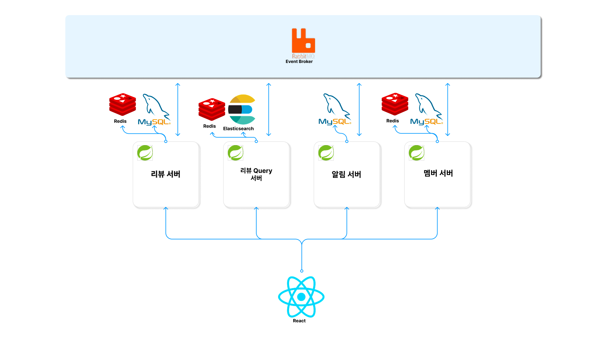
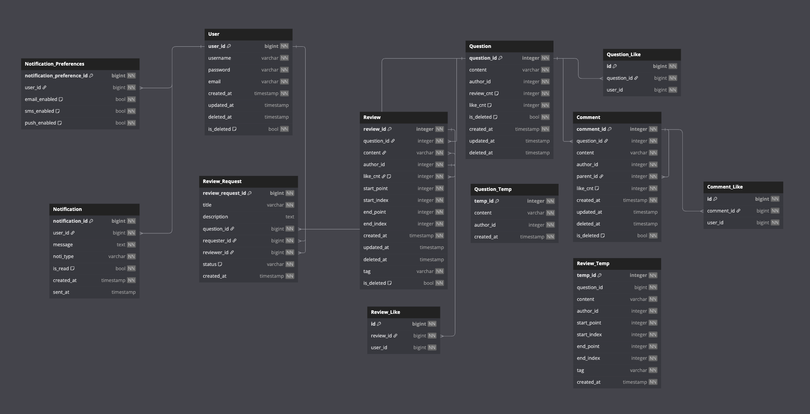
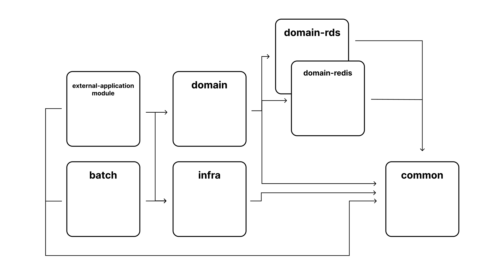

# ZZUAG - [Refactoring]

----

## 프로젝트 소개
ZZUAG은 코드리뷰에 익숙하지 않은 새싹 개발자들을 위한 코드리뷰 플랫폼입니다.

지난 2024 스마일게이트 데브캠프에서 진행된 프로젝트를 리팩토링중에 있습니다.

## Tech Stack
***Server***

  
 

***Database***

  
 

***Event Broker***

## Architecture

## ERD

## Multi Module Hierarchy

## 🔑 서비스 주요 기능
### 1. 라인 리뷰
   > 특정 코드 줄을 하이라이트하여 직접 피드백을 남길 수 있습니다.

### 2. 코드 블록 리뷰
   > 코드 블록 단위로 리뷰를 작성하여 전체적인 코드 흐름에 대한 피드백을 제공할 수 있습니다.

### 3. 댓글을 통한 코드 리뷰 토론
   > 리뷰에 대한 추가 논의를 위해 댓글 기능을 지원합니다.

### 4. 리뷰 검색 기능
   > 다른 개발자들이 남긴 코드 리뷰를 검색하여 학습 자료로 활용할 수 있습니다.

### 5. 리뷰 링크 공유
   > 리뷰는 개별 링크를 통해 공유 및 접근이 가능하여 협업을 더욱 쉽게 만듭니다.

## 팀원 소개

|                               김종준(BE)                                |                               김현우(FE)                               |                             신승용(BE)                              | 이규민(FE)                                                               |
|:--------------------------------------------------------------------:|:-------------------------------------------------------------------:|:----------------------------------------------------------------:|-----------------------------------------------------------------------|
|  |  |  |  |
|            [@belljun3395](https://github.com/belljun3395)            |            [@krokerdile](https://github.com/krokerdile)             |              [@sso9594](https://github.com/sso9594)              | [@Klomachenko](https://github.com/Klomachenko)                        |
